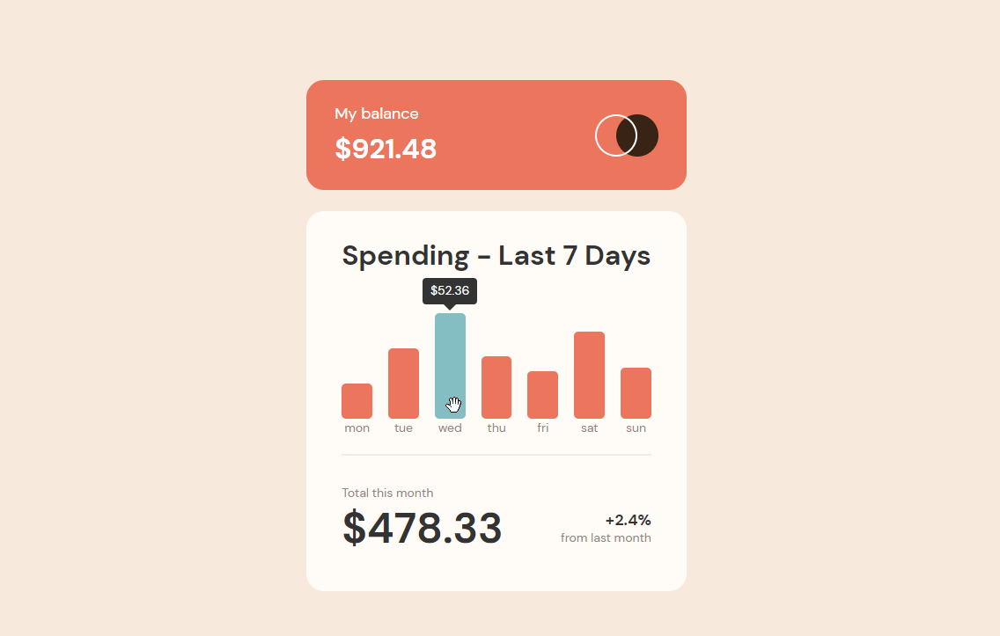

  # fem-expense-chart
  
## Description
Frontend Mentor challenge to create an expense chart component using whatever technologies you liked.

## Desktop Screenshot

## Mobile Screenshot

## Table of Contents
* [License](#license)
* [Questions](#questions)

## License

  
A short and simple permissive license with conditions only requiring preservation of copyright and license notices. Licensed works, modifications, and larger works may be distributed under different terms and without source code.

## Questions
Visit my [Github](http://www.github.com/kpessa) at github.com/kpessa